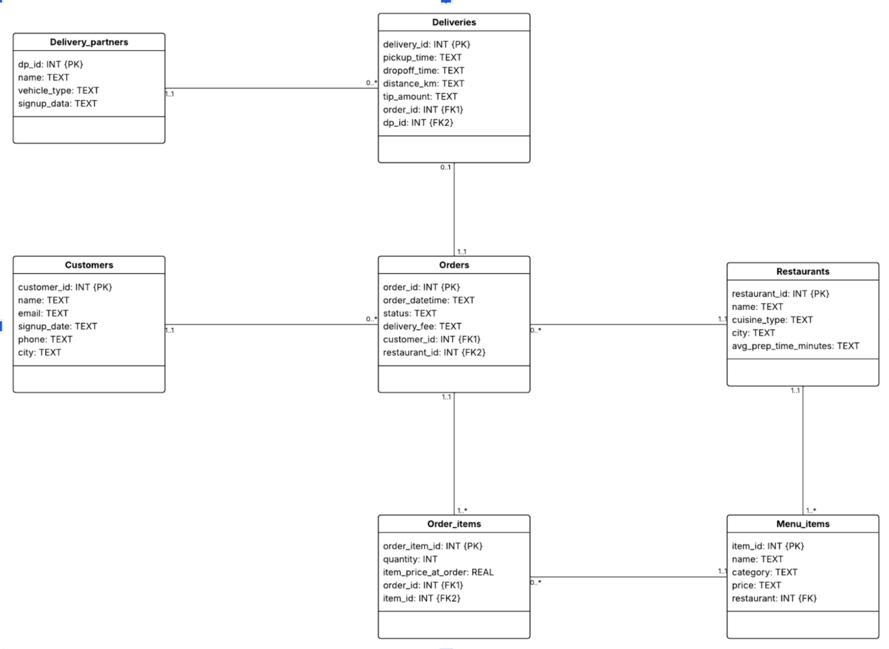
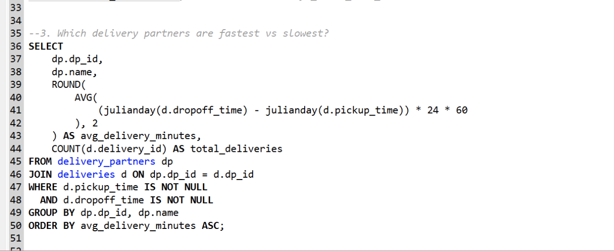
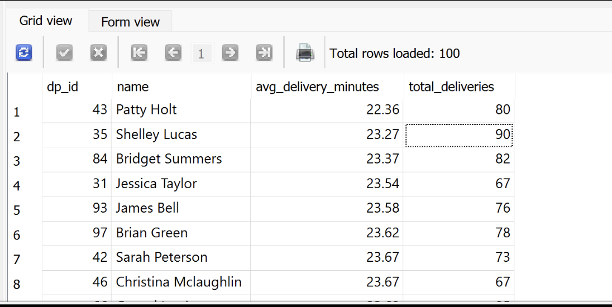
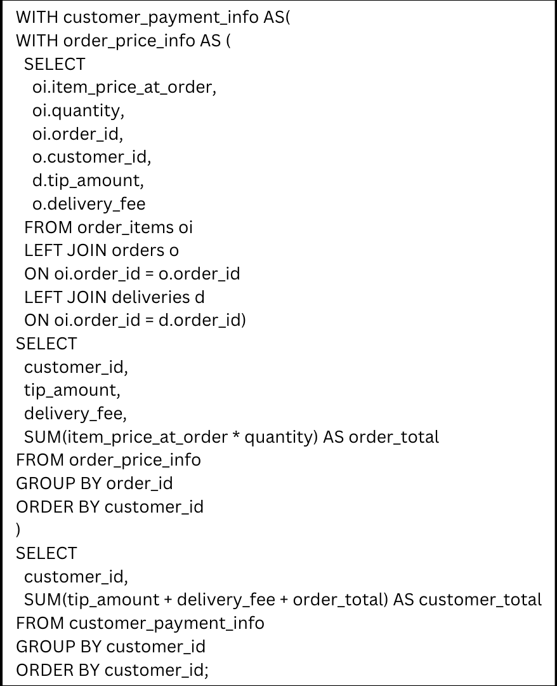
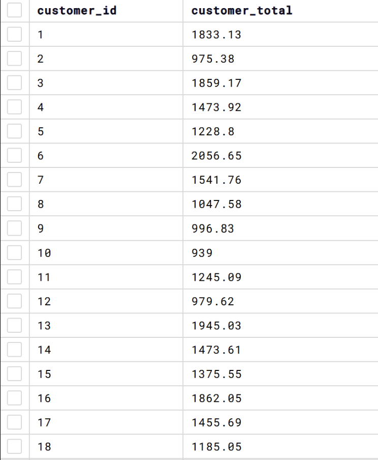
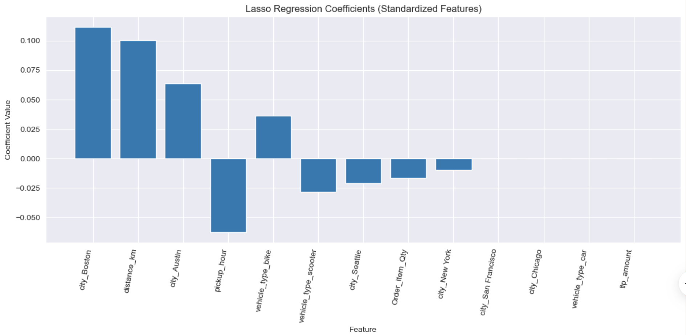

## Overview

## 🍔 From Order to Doorstep

This project explores the operational backbone of a digital food delivery marketplace. Using relational data across customers, restaurants, menu items, orders, and deliveries, I analyzed how the platform functions end to end and uncovered insights about customer spending, restaurant operations, courier efficiency, and delivery performance.

In a food delivery marketplace, the customer experience depends on much more than simply placing an order. Behind every completed transaction is a chain of coordinated actions involving restaurants, delivery partners, and the platform itself. This project examines that full lifecycle and shows how structured data can be used to evaluate both business performance and service quality.

## Business Context

Digital food delivery platforms operate as a two sided marketplace connecting customers with restaurants, while also relying on delivery partners to fulfill the final step of service. This makes them especially data rich and operationally complex.

The dataset represents the full journey of an order from the moment a customer browses the app to the point where food arrives at their doorstep. Because each entity is connected through a relational schema, the database makes it possible to evaluate both financial and operational outcomes across the platform.

### What this database captures

- Customer identity, activity, and location for segmentation and retention analysis
- Restaurant supply, cuisine offerings, and menu level sales
- Orders, fees, and transaction outcomes as the revenue engine of the platform
- Delivery execution, including partner assignment, timing, and cost to serve

## Why This Project Matters

This project goes beyond simple reporting. It reflects the types of business questions that matter in real marketplace environments.

For example:

- Which customers generate the most value over time
- Which restaurants or menu items are most profitable
- Which delivery partners are most efficient
- Where delays, bottlenecks, or quality issues may be affecting service

These questions sit at the intersection of analytics, operations, and strategy, making this a strong example of how data can be used to support decision making in a real business setting.

## Database Structure and ERD

The schema is designed to model the full operational workflow of the marketplace.

### Core entities

**customers** stores customer identity and location information, enabling segmentation and lifecycle analysis.

**orders** acts as the central transaction table and captures demand, revenue, fees, and fulfillment outcomes.

**restaurants**, **menu_items**, and **order_items** together represent the purchasing funnel, allowing analysis at both the restaurant and item level.

**deliveries** connects completed orders to delivery partners, making it possible to evaluate speed, reliability, and cost efficiency.

### Core business processes supported

- Customer acquisition and lifecycle management
- Restaurant onboarding and menu publishing
- Order placement and transaction processing
- Item level sales and profitability analysis
- Courier assignment and delivery execution
- Marketplace coordination and service quality monitoring

### ERD relationships

- Customers (1,1) — (0,*) Orders  
  Each order belongs to exactly one customer, while a customer may place zero to many orders.

- Delivery Partners (1,1) — (0,*) Deliveries
  Each delivery must be handled by exactly one driver, while a driver may complete zero to many deliveries.

### ERD

{fig-align="center" width=85%}

## Analytical Focus

My goal was to turn the relational structure of this database into actionable business insight. I approached the project through both SQL analysis and machine learning, using the database not just to answer static questions, but to understand how the marketplace behaves operationally.

## SQL Analysis and Business Insights

## 1. Delivery Partner Performance 🚴

One of the clearest operational questions was identifying which delivery partners were the fastest and which were the slowest.

Using SQL, I calculated average delivery times by partner and compared their performance across completed deliveries.

**Key finding:** Delivery speed varied clearly across delivery partners.

{fig-align="center" width=85%}
{fig-align="center" width=85%}

The fastest drivers, including **Patty Holt**, **Shelley Lucas**, and **Bridget Summers**, averaged roughly **22 to 23 minutes per delivery**. On the other end, drivers such as **Luke Peterson**, **Randy Kent**, **Joseph Lopez**, and **Martha Torres** averaged closer to **27 minutes per delivery**.

That roughly **5 minute gap** is meaningful in a delivery marketplace. Even small delays can influence customer satisfaction, repeat ordering behavior, and perceptions of reliability.

### Why this matters

This type of analysis can help a delivery platform:

- identify high performing couriers
- investigate operational inefficiencies
- improve dispatching decisions
- support service quality monitoring

## 2. Customer Spending and Delivery Economics 💳

Another question I explored was how much individual customers spend across the platform once delivery fees and tips are included.

This analysis required layered SQL logic and window functions to calculate the full cost of each customer's orders over time. Rather than looking only at food subtotal, I focused on the broader contribution each customer makes to the delivery business model.

**Key finding:** Customer value is not just about order count, but also about total spend including fees and tips.

{fig-align="center" width=85%}
{fig-align="center" width=85%}

This matters because delivery platforms often earn a share of meal revenue while also benefiting from service fees and delivery charges. Customers who order frequently and spend more per transaction are especially valuable to long term marketplace profitability.

### Business value of this analysis

- supports customer segmentation
- helps identify high value users
- informs targeted retention or loyalty strategies
- provides a clearer picture of lifetime value contribution

## Machine Learning Problem

## Predicting Delivery Time ⏱️

To extend the project beyond descriptive analytics, I framed a machine learning problem around **approximating delivery time**.

Delivery time is a critical operational metric because it affects customer satisfaction, platform efficiency, and courier planning. I tested multiple regression based approaches to estimate how long a delivery would take and to understand which variables were most strongly associated with delays.

{fig-align="center" width=85%}

### What I expected

Initially, I hypothesized that **distance** would be the strongest driver of delivery time.

### What I found

Interestingly, the **lasso regression** results suggested something different. The variable with the strongest impact on longer delivery times was not distance, but **being in Boston**.

**Unexpected insight:** Geographic context appeared to matter more than raw distance alone.

This is likely due to omitted variable bias. The model did not include important real world factors such as traffic, road design, parking difficulty, and urban density, all of which can severely affect city deliveries.

### Interpretation

This result reinforced an important lesson in analytics: the most intuitive variable is not always the most explanatory one. In real business settings, hidden operational complexity often shapes outcomes more than we initially expect.

## Key Takeaways

### Main insights from the project

- Food delivery marketplaces can be analyzed as a full lifecycle system rather than a set of isolated transactions
- SQL is highly effective for uncovering operational trends in courier performance and customer value
- Small differences in delivery speed can have meaningful effects on customer experience
- Delivery economics become more informative when fees and tips are included in customer spending analysis
- Predictive modeling can reveal hidden drivers of performance, even when the model is imperfect

## Limitations

No analysis is complete without acknowledging its limits.

### Constraints in the dataset

- Too many features made the model more generic and less interpretable
- The data was not well segmented, which reduced prediction accuracy
- The dataset covered only **10 months**, so yearly seasonality could not be analyzed

## Recommendations

Based on the findings, I would recommend expanding both the feature set and the segmentation strategy for future analysis.

### Recommended next steps

- Add features for **time of day** and **day of week**
- Break the dataset into more homogeneous groups for stronger prediction accuracy
- Build separate models for specific contexts, such as city based deliveries or bike only deliveries
- Include operational variables such as traffic conditions and street layout where possible

### Example of a stronger future prediction problem

Instead of predicting all deliveries at once, a more targeted model could estimate:

**How long will a New York bike delivery take on a Friday night at 6 PM?**

This type of narrower prediction would likely be much more useful for real operational planning and customer facing delivery estimates.

## Final Reflection

This project demonstrates how structured relational data can be transformed into a business story. By combining database design, SQL analysis, and predictive modeling, I was able to explore how a digital marketplace operates across customers, restaurants, and couriers.

From identifying the fastest delivery partners to examining customer spending behavior and modeling delivery times, this work reflects the kind of analysis that supports real operational and strategic decisions.

For me, this project was especially valuable because it combined technical analytics with business context. It reinforced the idea that effective data analysis is not just about querying tables or building models. It is about understanding how systems work, where inefficiencies emerge, and how data can guide better decisions.

## Tools Used

- SQL
- Relational database design
- Entity relationship modeling
- Regression based machine learning
- Business analytics
- Operational analysis

## Portfolio Note

This case study reflects my interest in using data analytics to solve real business problems, especially in operational and marketplace environments where customer behavior, logistics, and performance are closely connected.