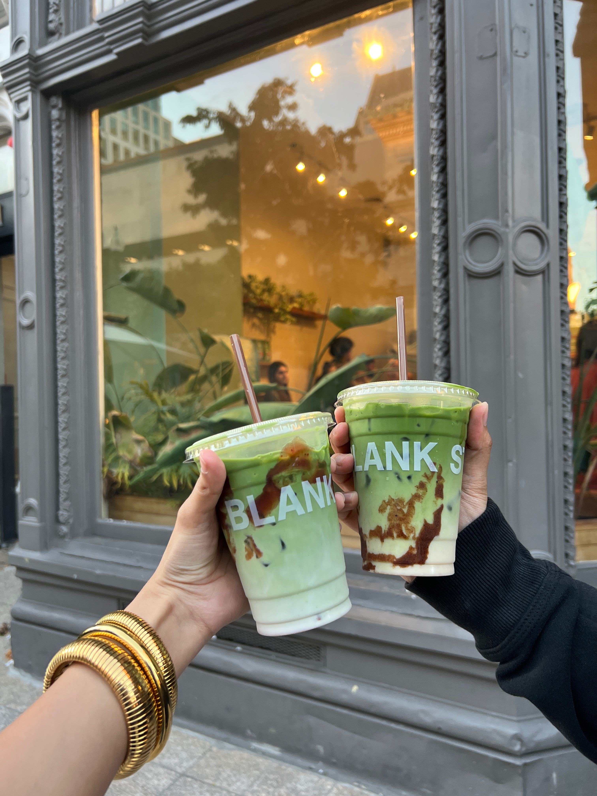

::: {.card .p-4 .mb-4}
## 👋 Hi, I’m Essha Khan

I’m a Master’s student in Applied Business Data Analytics at Boston University, with a strong interest in using data to solve real world business problems. This site serves as a collection of my academic, technical, and personal work, showcasing projects that reflect both analytical depth and practical application.

My work focuses on data analytics, machine learning, business intelligence, and data driven decision making. I am especially interested in how data can be used to bridge the gap between technical analysis and business strategy.

Whether you’re here to explore my projects or learn more about my background, welcome.
:::

::: {.card .p-4 .mb-4}
## 🎓 Education & Experience

I completed my undergraduate degree in **Technology**, with a focus on **Graphic Communications Management** and a minor in **Marketing** at **Ryerson University**.

Professionally, I interned at **Royal Bank of Canada** as a **Digital Innvation Specialist** where I gained experience working in collaborative environments and supported digital initiatives and cross functional projects. These experiences strengthened my ability to translate complex ideas into clear, actionable insights.
:::

::: {.card .p-4 .mb-4}
## 🧠 Projects & Analytical Work

The projects featured on this site reflect my ability to work across the full data pipeline, from data cleaning and exploration to modeling and visualization.

Some highlights include:

- **Job Market Analysis:** using a large scale dataset to uncover trends in skills, salaries, and hiring demand
- **Food Delivery Marketplace Analysis:** exploring customer behavior, courier performance, and operational efficiency
- **NYC Real Estate Transaction Data:** Analyzed NYC real estate data using R and Power BI to uncover pricing trends, anomalies, and neighborhood-level insights, presenting findings through data-driven storytelling.
- **Microbrewery Investment Business Case:** Evaluated the feasibility and profitability of a microbrewery investment using business simulation and analytical frameworks such as SWOT, PESTEL, and scenario analysis to support strategic decision-making.

Through these projects, I aim to not only analyze data, but also tell meaningful stories that support better decision making.
:::

::: {.card .p-4 .mb-4}
## 🚀 Interests & Goals

I am particularly interested in roles within **data analytics** and **product analytics**, where I can combine technical skills with business context to drive impact.

My goal is to work on data driven products and strategies that improve decision making, optimize operations, and enhance user experiences. I am especially drawn to environments where analytics, technology, and business intersect.

:::

::: {.card .p-4 .mb-4}
## ✨ A Bit More About Me

Beyond data and analytics, here are a few things that make me, me:

- 🐱 Cat owner to the cutest British Shorthair  
- 🍵 Matcha enthusiast who appreciates a well-crafted cup  
- 📸 Enjoy portrait photography 

::: {.grid}
::: {.g-col-3}

:::

::: {.g-col-3}

:::

::: {.g-col-3}

:::
:::

